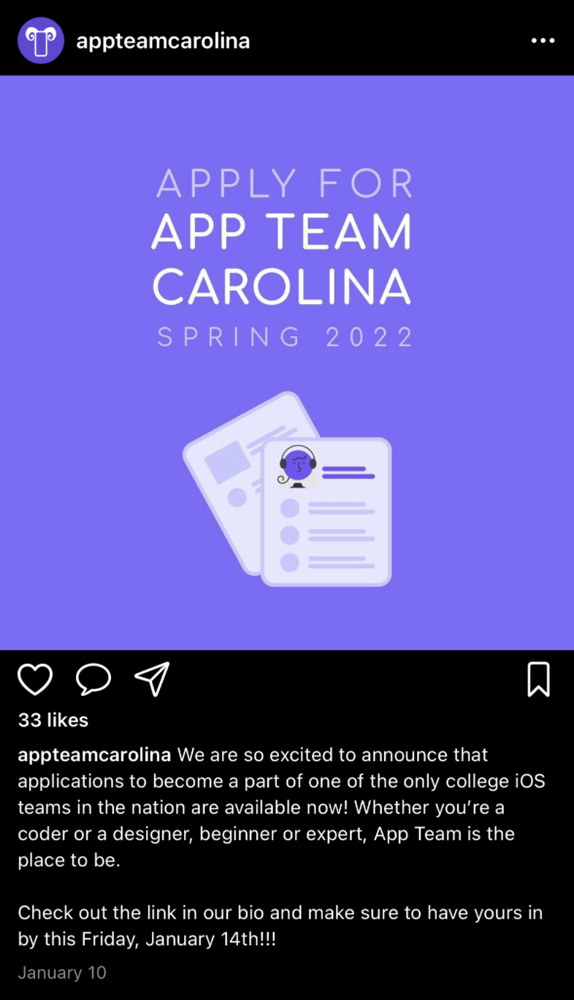
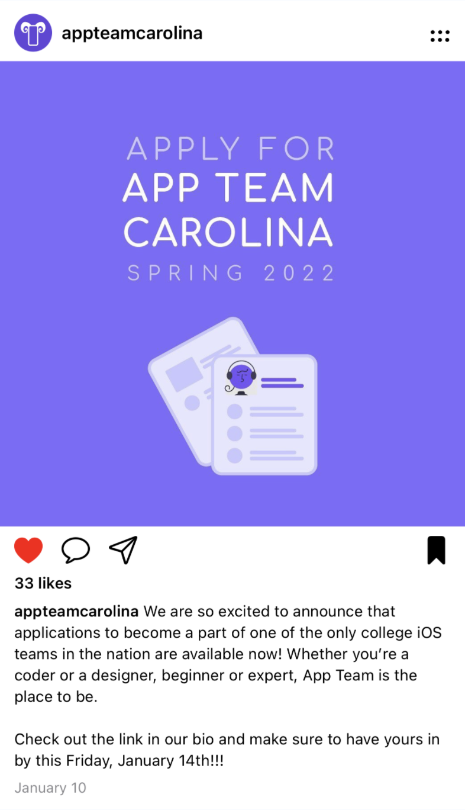
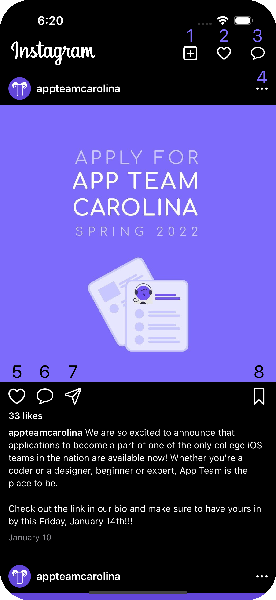

# f22-apprenticeship-p00
Instagram recreation using `Swift` & `SwiftUI`
> iOS Apprenticeship - Fall 2022


## Description

This week, we’ll be doing a visual recreation of **Instagram** using Swift and SwiftUI.

## **Learning Objectives**

We are doing this project to re-familiarize ourselves with…

1. Laying out user interfaces with SwiftUI
2. Making dynamic interfaces that respond to input
3. Writing code and running apps in Xcode

## Starter code

You’ll be provided with pretty well-developed starter code to give you a framework to help you get started and speed up your iteration process.

## Stages

> **If you have trouble pushing your completed code to GitHub…**<br/>
We will be talking about Git & GitHub next week, so feel free to wait until then.

</quote>

- [ ]  Read through this entire Notion page (even Hints & Tips at the bottom)
- [ ]  Accept GitHub Classroom Assignment
- [ ]  Clone GitHub repository to your local machine
- [ ]  Explore and get familiar with starter code
- [ ]  Implement single post view in `PostView.swift`
- [ ]  Implement scrolling feed in `FeedView.swift`
- [ ]  Implement navigation bar in `ContentView.swift`
- [ ]  Push completed code to your GitHub repository

## GitHub Classroom Link

**Click [here](https://classroom.github.com/a/Rs8QQ9Ct) to accept the GitHub Classroom link.**

After you’ve finished accepting the GitHub classroom, paste the link to your repository into the table above. It should look something like this…

```
https://github.com/appteamcarolina/apprenticeship-f22-p##-username
```

## Design Spec

> **How we communicate requirements between designers and developers.**

    

### How to display a single post

Four sections with `8pts` of space between each one.

***Author View***

- Horizontal spacing between elements: `8pts`
- Circular profile picture. Size: `30x30pts`
- Username label. Font: `subheadline` Weight: `bold`
- Options button. Symbol: `ellipsis`. Size: `16x16pts`

***Main Image***

- Resizes and scales to fill entire screen width

***Engagement View***

- All buttons are of size `24x24pts`
- Horizontal spacing between elements: `16pts`
- Like button. `heart`/`heart.fill`. `.primary`/`.red`
- Comment button. `message` symbol
- Share button. Symbol: `paperplane`. Color: `.primary`
- Save button. Symbol: `bookmark`/`bookmark.fill`. Color: `primary`

***Post Information***

- Vertical spacing between elements: `8pts`
- Like count. Font: `.footnote`. Weight: `.semibold`
- Caption. Font: `.footnote`. Username in bold
- Timestamp. Font: `.caption`. Color: `.secondary`
- Aligned to leading edge

### Putting it all together


### Navigation Bar

Use the built-in SwiftUI navigation bar for this part.

- Cursive logo in principal slot. `120pts` wide
- Horizontal spacing between buttons: `28pts`
- All navigation buttons are of size `20x20pts`
- New post button. Symbol: `plus.square`
- Notifications button. Symbol: `heart`
- Direct messages button. Symbol: `message`

### Scrolling feed

The user should be able to see a scrollable feed of posts

- `8pts` of vertical space between each post
- Hide the scroll bar/scroll indicator
- Display a list of App Team Carolina’s posts for prototype


## Interaction Spec

> **What should happen when you click on each button?**



1. **New Post Button**
   
   Push a new screen onto the navigation stack. Minimally, a label saying “New Post”.

2. **Notifications Button**

   Push a new screen onto the navigation stack. Minimally, a label saying “Notifications”.

3. **Direct Messages Button**

   Push a new screen onto the navigation stack. Minimally, a label saying “Direct Messages”.

4. **More Options Button**

   Push a new screen onto the navigation stack. Minimally, a label saying “Direct Messages”.

5. **Like Button**

   Toggle the color and filled/unfilled status of the like button.

6. **Comment Button**

   Push a new screen onto the navigation stack. Minimally, a label saying “Comments”.

7. **Share Button**

   Push a new screen onto the navigation stack. Minimally, a label saying “Share”.

8. **Save Button**

   Toggle the filled/unfilled status of the save button.

## Hints & Tips

- Use the custom-built `.resizableSquare(dimension: ...)` modifier for the square buttons
- Use `Text("\(**post.author.username**) \(post.caption)")` in the post details
- Try not to use any number literals in your view code. Use the pre-written constants instead
- In `PostView.swift`, put all of your `.padding(...)` modifiers in the `body` property
